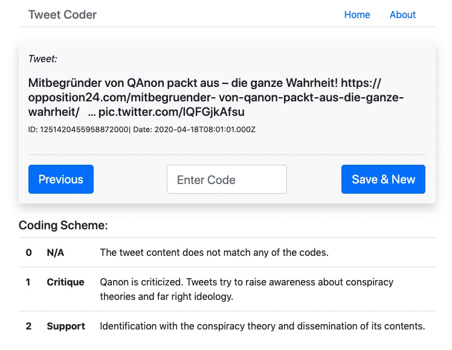

# tweet_codes

### What is this?

This is a minimalistic web-app that can be used to provide tweets (saved in a MongoDB) with codes based on your own coding-scheme, in order to analyse the tweets later throught QDA, machine learning, etc. The tool was developed for a ML-project in social sciences, where i wanted to train the [readme2-Algorithm](https://github.com/iqss-research/readme-software) in R to automatically code huge amounts of tweets in order to investigate how certain attitudes towards a topic/hashtag change over time within the Twitter community.

### How is it built?

It is built as a full stack MEVN-app based on [MEVN-CLI](https://github.com/madlabsinc/mevn-cli) thought for local use with a local MongoDB installation.

The JSON-model used in the app to map the tweets is based on the collections generated by [TweetScraper](https://github.com/jonbakerfish/TweetScraper), which I use to scrape tweets and save them directly into a MongoDB collection.

### How to use it?

1. Install [node.js](https://nodejs.org/), [npm](https://www.npmjs.com/), [MongoDB](https://www.mongodb.com) and [MEVN-CLI](https://github.com/madlabsinc/mevn-cli).
2. Get [TweetScraper](https://github.com/jonbakerfish/TweetScraper) and edit `settings.py` to save the tweets into a MongoDB collection. Scrape some tweets then.
3. Clone this repository: `git clone https://github.com/nomaad/tweet_codes.git`
4. Edit `server/config/config.js`  to point to your local MongoDB collection
5. To add your coding scheme reference, edit `client/src/components/CodeScheme.vue`
6. Run `mevn serve`and start the server first, then open another terminal window and run it again to start the client. Happy coding.
